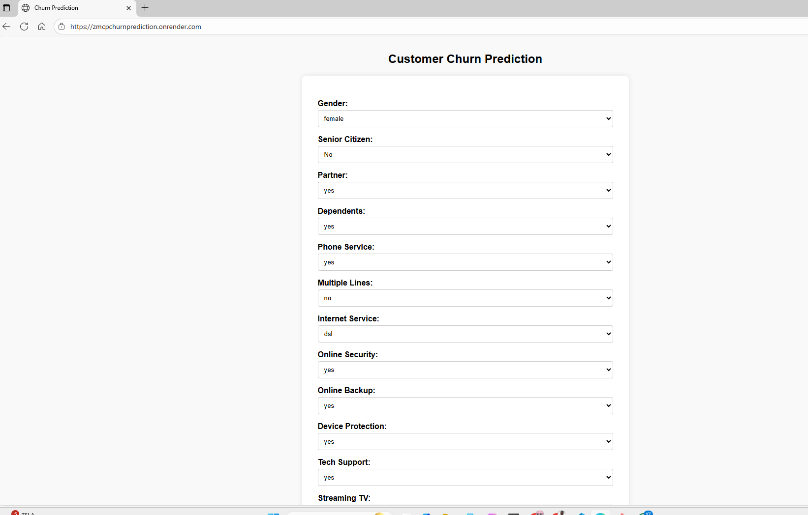

# 🧠 Customer Churn Prediction Service

A production-ready **FastAPI** microservice for predicting customer churn.  
This project packages a trained `scikit-learn` pipeline into a containerized REST API and web app, deployed on **Render** using **Docker** and **UV** dependency management.

---

## 🚀 Live Demo

🔗 **App URL:** [https://zmcpchurnprediction.onrender.com](https://zmcpchurnprediction.onrender.com)

The web interface allows users to enter customer details and instantly get a churn probability and decision.

---

## ⚙️ Tech Stack

| Component        | Purpose                                          |
| ---------------- | ------------------------------------------------ |
| **FastAPI**      | Web framework for serving predictions            |
| **scikit-learn** | Trained ML pipeline (Logistic Regression)        |
| **UV**           | Fast dependency installer and virtualenv manager |
| **Docker**       | Containerization for consistent deployment       |
| **Render**       | Cloud hosting for the live web app               |
| **Jinja2**       | Template engine for the frontend HTML form       |

---

## 📸 Screenshots

**Web UI Form**

  

---

## 🧩 Project Structure

TBA

---

## 🧑‍💻 Author

**Kelvin Ofori-Minta, PhD**  
📍 Indianapolis, IN  
📧 [k.mintah28@gmail.com](mailto:k.mintah28@gmail.com)  
🔗 **LinkedIn:** [https://www.linkedin.com/in/kelvin-ofori-minta-9a5692b8/](https://www.linkedin.com/in/kelvin-ofori-minta-9a5692b8/)

---
